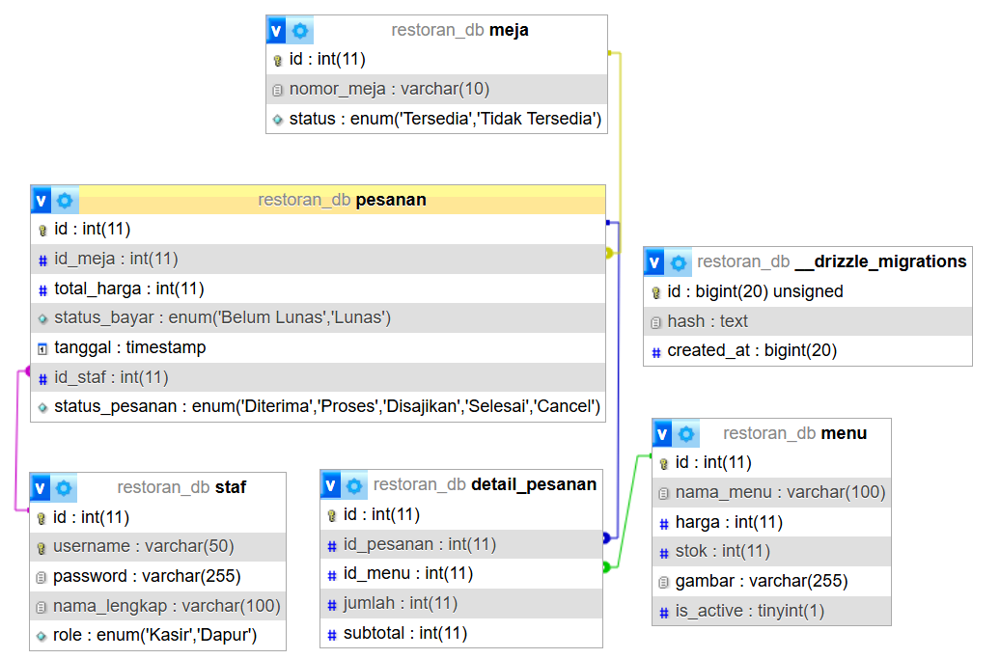

# 🍽️ Sistem Pemesanan dan Manajemen Restoran

## 🎯 Deskripsi & Penyelesaian Masalah
Aplikasi ini dikembangkan untuk memecahkan beberapa masalah operasional di restoran, yaitu:
* **Mengurangi Antrean:** Meminimalisir antrean panjang pelanggan yang hanya ingin memesan makanan di kasir.
* **Ketersediaan Meja:** Pelanggan dapat melihat secara langsung meja mana saja yang kosong saat hendak memesan tanpa harus mencari secara manual.
* **Akurasi Pesanan:** Meminimalisir kasus salah pesanan atau salah sasaran meja akibat human error.
* **Pelacakan Real-time:** Pelanggan bisa melacak status pesanan mereka (Diterima, Proses, Disajikan, Selesai, Cancel) dan melihat total tagihan berdasarkan nomor pesanan secara langsung.
* **Manajemen Kasir & Dapur:** Kasir dapat menambah menu, mengelola meja, mengonfirmasi pembayaran, serta melihat riwayat pesanan dengan sistem yang saling terintegrasi.

## 👥 Anggota Kelompok & Pembagian Tugas
| Nama Anggota | Pembagian Tugas Konkret |
| :--- | :--- |
| **[Giovani Sapta Purnama A (2024520043)]** | Merancang antarmuka (UI/UX) dan *wireframe*, mengembangkan halaman antarmuka pelanggan dan kasir (Frontend), serta integrasi respons API ke komponen visual. |
| **[Yuris Ikrar Rabbani (2024520028)]** | Merancang arsitektur sistem dan Entity Relationship Diagram (ERD), menyusun skema database beserta kueri SQL, serta membangun logika backend (API, routing, dan kontroler). |

## 🗄️ Skema Database (ERD)
Berikut adalah visualisasi relasi antar tabel dalam database aplikasi restoran kami:




**Daftar Tabel Utama:**
1. **Staf:** Menyimpan kredensial pekerja (`username`, `password`, dan `role` Kasir/Dapur).
2. **Meja:** Menyimpan data `nomor_meja` dan `status` ketersediaan.
3. **Menu:** Menyimpan detail hidangan, `harga`, `stok`, status aktif, dan `gambar`.
4. **Pesanan:** Tabel utama transaksi yang mencatat `id_meja`, `total_harga`, `status_bayar`, `status_pesanan`, dan `id_staf` yang menangani.
5. **Item_Pesanan:** Tabel relasi/detail (keranjang) yang menyimpan `id_menu`, `jumlah`, dan `subtotal` untuk setiap pesanan.

## 🌐 Dokumentasi Ringkas Endpoint API
Base URL untuk semua rute di bawah ini adalah: `/api`

| Modul | Method | Endpoint Path | Payload Body (Ringkas) | Format Respons (Ringkas) |
| :--- | :--- | :--- | :--- | :--- |
| **Auth** | `POST` | `/auth/register` | `username`, `password`, `nama_lengkap`, `role` | `201` Data staf berhasil didaftarkan |
| | `POST` | `/auth/login` | `username`, `password` | `200` Data profil staf & Token akses |
| **Meja** | `GET` | `/meja` / `/meja/:id` | - | `200` Daftar semua meja / detail 1 meja |
| | `POST` | `/meja` | `nomor_meja`, `status` | `201` Pesan sukses & Insert ID |
| | `PUT` | `/meja/:id` | `nomor_meja`, `status` | `200` Pesan sukses update |
| | `DELETE`| `/meja/:id` | - | `200` Pesan sukses hapus |
| **Menu** | `GET` | `/menu` | - | `200` Daftar seluruh menu |
| | `POST` | `/menu` | FormData: `nama_menu`, `harga`, `stok`, `gambar`| `200` Pesan sukses tambah menu |
| | `PUT` | `/menu/:id` | FormData: data menu lama/baru + `gambar` | `200` Pesan sukses update menu |
| | `DELETE`| `/menu/:id` | - | `200` Pesan sukses hapus menu |
| **Pesanan**| `POST` | `/pesanan` | `id_meja`, `total_harga`, `keranjang[]` | `201` Mengembalikan `id_pesanan` |
| | `GET` | `/pesanan/aktif` | - | `200` List pesanan (Diterima, Proses, Disajikan) |
| | `GET` | `/pesanan/riwayat`| - | `200` List seluruh data pesanan tanpa filter |
| | `PUT` | `/pesanan/:id` | `status_bayar`, `status_pesanan`, `id_staf`| `200` Pesan sukses update pesanan |
| | `POST` | `/pesanan/bayar` | `id_pesanan`, `id_staf` | `200` Konfirmasi pembayaran sukses |
| | `GET` | `/pesanan/dapur` | - | `200` List pesanan yg sudah Lunas u/ dimasak |
| | `PUT` | `/pesanan/:id/status`| `status_pesanan` | `200` Update status singkat |
| | `GET` | `/pesanan/:id/lacak` | - | `200` Detail lengkap 1 pesanan u/ pelanggan |

## 🚀 Cara Menjalankan Aplikasi (Lokal)
Ikuti panduan berikut untuk menjalankan aplikasi ini di komputer Anda:

1. **Clone Repositori & Masuk ke Direktori**
   ```bash
   git clone git@github.com:yurisikrar/SistemPemesananDanManagementRestoran.git
   cd SistemPemesananDanManagementRestoran/backend
   ```
2. **Install Dependensi**
   * ekstrak modules.zip 
3. **Konfigurasi Database**
   * Buat database baru di MySQL atau sistem manajemen database Anda.
   * Salin/rename file `.env.example` menjadi `.env`.
   * Sesuaikan `DB_NAME`, `DB_USER`, `DB_PASS`, dan variabel koneksi database lainnya di dalam file `.env`.
4. **Migrasi Database dan Jalankan Aplikasi**
   ```bash
   npm run db:migrate
   npm run db:seeds
   npm run dev
   ```
   *Server backend akan mulai berjalan.*
5. **masuk ke directory frontend**
   ```bash
   cd SistemPemesananDanManagementRestoran/frontend/restorant
   ```
6. **Install Dependensi**
   * ekstrak modules.zip
7. **Jalankan Frontend**
   ```bash
   npm run dev
   ```
8. **Membuka Aplikasi**
   * Membuka localhost:5173 untuk masuk ke landing page
   * Membuka localhost:5173/login untuk ke dashboard dan login menggunakan kasir default
     ```bash
     username : kasir1
     password : kasir123
     ```
